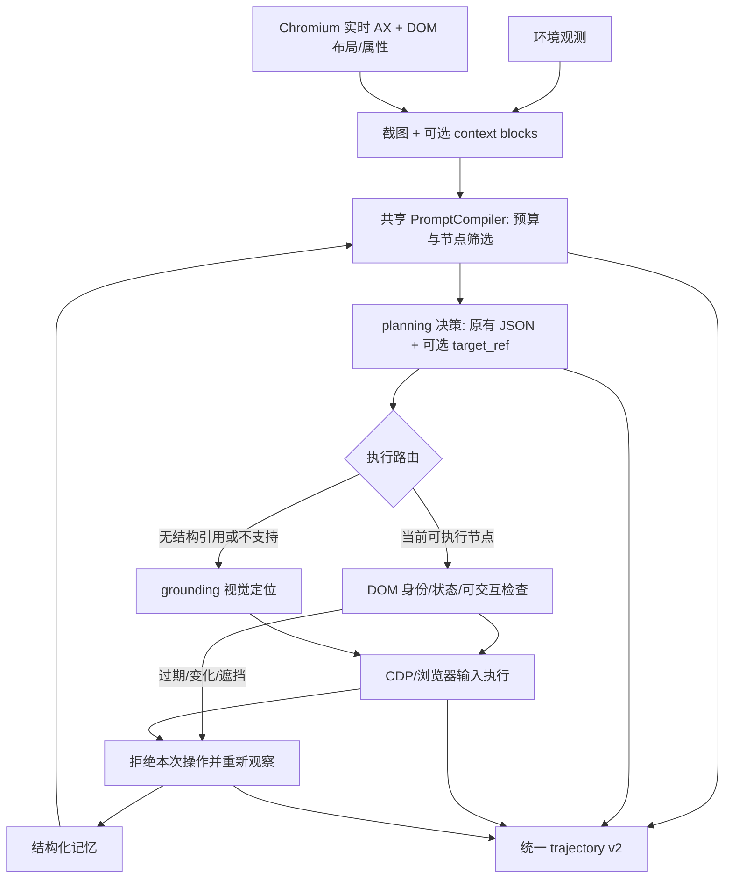

# 浏览器混合架构与统一训练轨迹

当前实现已经升级为决策与定位模型独立配置的节点/视觉双模式架构。完整 AX 保留在本地检索，模型分别接收有预算的决策语义与定位候选；轨迹升级为 v3。当前接口、预算、职责命名与验证见 [网页定位实现](网页定位实现.md)。本文后续记录的是第一版 v2 架构，DOMSnapshot、默认视觉定位链路和旧预算说明已由新实现替代。

2026-09-30 更新：加入显式 browser_use / structure_available 场景状态，普通场景仅用视觉感知，网页退出/切换时失效旧结构。具体规则与验证范围见 [Browser use 场景判定](browser-use场景判定.md)。

**尚未完成的外部验证：**本机没有可用的 Qwen3.8 API 配置，因此没有做真实 Qwen3.8 推理或模型效果评估。下面的本机测试使用明确标记的脚本策略。OSWorld / VMware / Docker 的新接线未在真实虚拟机验证，不能据此声称 OSWorld 得分提升。

## 1. 原架构的关键问题

原链路为 `Observation -> 拼 prompt + 3 张截图 -> decision -> UI-TARS -> env.step -> memory`。虽然已经有 `get_page_source` 和 AX 文本，但：

- 网页动作仍全部需要视觉定位，无法用 AX 节点直接执行。
- 工具按页面列表的最后一页选标签页，可能把后台页当成当前页；每次抓取重建 CDP 连接。
- AX 文本和 HTML 按字符直接截断，没有统一的输入预算，也不保留可执行引用。
- 轨迹 1.0 没有保存完整 policy input 和原始 output，难以复现真实训练条件；历史标注图、失败重试、终止与超时状态也不完整。
- 默认 grounding 有返回屏幕中心的占位实现；完成验证调用失败会直接放行。两者会污染执行和训练标签，本次均已修正。

## 2. 新链路



AX 应从浏览器实时渲染状态取得，而不是把下载的 HTML 用通用解析器“猜成”AX。浏览器已经计算了可访问名称、role、ignored、checked、expanded 等信息；页面脚本渲染结果也包含在其中。实现调用 `Accessibility.getFullAXTree`，并通过 `DOMSnapshot.captureSnapshot` 补布局、tag、href、frame。依据：[CDP Accessibility](https://chromedevtools.github.io/devtools-protocol/tot/Accessibility/)、[CDP DOMSnapshot](https://chromedevtools.github.io/devtools-protocol/tot/DOMSnapshot/)。

保留正文、heading、状态提示和层次，不只收集按钮。否则模型可能找到按钮，却不知道当前处于流程哪一步、哪个业务状态或是否已完成。当前筛选优先级兼顾任务相关性、可交互控件、焦点、可见区域，并优先保留 alert/status/dialog 及其文字。

### 执行契约

策略继续输出统一动作，例如：

```json
{
  "next_action": {
    "type": "type",
    "target": "The Customer name input",
    "target_ref": "e0f7a938419a:12",
    "text": "Acme Ltd",
    "overwrite": true
  }
}
```

`target` 是语义意图，所有任务都有；`target_ref` 是可选的执行证据，不需要新建一套 browser action schema。引用由程序产生，只在当前快照有效；不会要求模型生成 CSS/XPath，也不会接受模型自己填写执行坐标。

有引用时先验证其确实出现在当前 policy input，再检查 document、URL、节点身份、role/name、值与 checked/selected/expanded 等状态。通过 `DOM.resolveNode` 找到原节点，检查是否连接、可见、禁用、遮挡、位置是否稳定，然后使用浏览器输入通道。重复名称的节点仍可按 backend ID 区分。依据：[CDP DOM](https://chromedevtools.github.io/devtools-protocol/tot/DOM/)。

当前确定性动作覆盖 click、double_click、right_click、type、原生 select、scroll。点击和输入使用浏览器鼠标/键盘事件；原生 select 设置选项并派发 input/change。自定义下拉菜单使用先 click 再点击选项。输入后是否业务保存成功，仍需下一观察和独立 evaluator 判断。

无法结构化定位时保留 UI-TARS 路径。**发生过期、语义变化或可能已经派发事件的错误时，本步先重新观察，不再立刻补一次视觉点击**，避免同一业务动作执行两次。

### 坐标和环境边界

- `BrowserEnvironment` 在本机 Chrome/Edge 中运行，截图为 CSS viewport 像素，视觉回退也使用该坐标空间。
- OSWorld 环境的截图保持桌面像素。DOM 执行通过 CDP 的 CSS 坐标通道完成，不把网页坐标直接冒充桌面坐标，不需要猜窗口边框或 DPI 偏移。
- 浏览器工具栏、原生文件对话框、canvas，以及当前未完整支持的 iframe/OOPIF 场景保留视觉回退；本机 browser-only 环境不提供 Windows 全桌面控制。
- 已连接浏览器必须能唯一识别获得焦点的网页；不再按“最后一个 tab”猜页面。页面信息和截图不是浏览器事务级原子快照，所以执行前仍必须重检。

## 3. 上下文预算

统一的 `PromptCompiler` 用于浏览器和桌面任务。默认参数如下，均可配置：

| 项目 | 默认值 | 用途 |
|---|---:|---|
| context_window | 32768 | 应设置成服务实际支持的上下文长度 |
| max_input_tokens | 12288 | 整体输入预算 |
| output_reserve | 2048 | 预留生成空间，至少为模型 max_tokens |
| safety_margin | 1024 | 额外余量 |
| max_images | 2 | 桌面最多两张截图 |
| structured_max_images | 1 | 有结构信息时默认仅当前截图 |
| image_tokens | 2048/张 | 图像 token 估计，必须按 Qwen processor 校准 |
| memory_tokens | 2200 | 记忆上限；程序状态和近期结果优先 |
| auxiliary_tokens | 1200 | 工具输出上限 |
| structure_tokens | 3500 | AX/结构信息上限 |

实际输入上限取 `min(max_input_tokens, context_window-output_reserve-safety_margin)`。先保留系统约束与完整任务，任务本身过长时明确报错，不静默截断任务。页面按完整节点选取，补充祖先，恢复原阅读顺序，同时记录选中/遗漏数量。格式纠错仅携带最近一次有界反馈，不无限累积失败输出。

未配置本地 tokenizer 时，以 UTF-8 字节数保守估算文本；这不是声称真实 Qwen token 数。配置 `tokenizer_path` 后用本地 tokenizer，且不自动从网络下载代码。图像 token 仍由 processor/分辨率决定，API 返回的 usage 应用于校准。控制图像分辨率、检查部署端 chat template、保留真实 tokenizer/processor 版本，是上线前需要完成的配置验证。

`get_page_source` 只用于 AX 缺少细节的情况。可传 target_ref 取局部 DOM；默认去脚本、样式、隐藏字段及不必要属性，限制返回长度，作为一次性工具结果。默认不在每步塞整页 HTML。页面与工具内容明确作为不可信数据处理；提示词中的隔离不能保证模型完全免疫 prompt injection，训练和测试仍需覆盖该场景。

## 4. 统一轨迹 v2：训练需要保存什么

浏览器和桌面共用顶层 `task/outcome/steps`。差别只在 `observation.context` 的可选内容，训练导出器不按 domain 分支。

| 字段 | 训练含义 |
|---|---|
| observation | 动作前截图、context、环境信息、观测 ID |
| policy_input | 该次决策实际收到的有序消息，包含 system、文字、实际发出的图像 |
| policy_output | 该次完整原始输出，保留空格/换行，不用事后摘要代替 |
| decision_calls | 所有格式重试及 API 元信息；每次都保存自己的输入、输出、是否有效 |
| prompt_metadata | 编译版本、预算估计、节点裁剪结果、暴露的 refs |
| action | 决策的语义动作 `{action,args}`，兼容原轨迹接口 |
| resolved_action / routing | 实际执行参数及 browser_dom / visual / reobserve 等通道 |
| grounding | 视觉目标与坐标；DOM 坐标另带 coordinate_space，不混用 |
| execution_info | 执行/拒绝/不确定、是否已派发、错误、耗时 |
| next_observation | 执行后观察；最后一步也保留截图 |
| assessment | 下一次决策对本步动作的评价，禁止回填到本步输入 |
| verification | 辅助完成核验调用，独立于策略训练样本 |
| reward | 环境的步级奖励；未知不制造 |
| terminated / truncated | 真正终止与达到步数/卡死上限分开 |
| outcome.score / evaluation_available | 独立任务得分及其是否可用 |

`dump_trajectory` 把所有图片以 SHA-256 去重落盘到 `assets/`，包括历史标注图和最终图；JSON 引用实际文件。`restore_messages` 可重新组成原来的 data URL 消息。测试已经逐条比较保存前后 policy input 完全相同。当前仍在一次任务结束时统一写盘，尚无逐步崩溃恢复日志。

### SFT

`iter_sft_records` 产出统一的 `prompt` 和 `completion`，只对最终 completion 做 loss。输入中可能出现格式纠错历史的 assistant 消息，它们也是输入，不能用“所有 assistant token 都算 loss”的简化规则。保存完整决策 JSON，包括可观测状态描述、记忆补丁和动作；不要求补写模型未提供的隐含推理。

默认仅导出独立 evaluator 成功、动作有效、非长度截断的样本。成功 episode 中的错误恢复步骤仍可能有价值，是否过滤由数据质量规则决定，不能把任务末尾成功倒推为每一步动作都成功。

浏览器训练时 target_ref 必须对应同条输入中的节点；桌面任务不带 ref，context 可以为空。外部轨迹通过 `import_external_episode` 映射到同一 schema。只有动作和截图却没有 prompt 的历史数据会标 `trainable=false`。若要重新编译这类数据，应明确标记“重建输入/重新标注”，重新生成与当前 action 协议匹配的标签，不能冒充原行为策略的真实输入。

建议数据配比包括纯 GUI、AX+截图、结构缺失/被截断、错误引用、canvas/弹窗回退、状态改变与纠错。做结构模态 dropout 时，必须同步移除或重新标注输出里的 target_ref；不能删掉 AX 输入却保留依赖它的引用标签。

### RL

API 轨迹可以用于 SFT 蒸馏和离线评估，**Qwen3.8 的采样概率不能用作 Qwen3.5-9B 的旧策略概率**。真正对 9B 做 PPO/GRPO 等训练时，需由对应 checkpoint 生成 rollout，并保存：

- 固定 `policy_revision`、tokenizer/processor 与 chat template 版本、实际采样参数。
- 精确的输入消息/图像及 completion token IDs、逐 token 行为策略 logprobs、停止原因。
- 独立 reward、transition 和终止/截断标志；训练端计算 advantage、KL、loss mask。
- 格式失败和重试也是策略产生的输出，不能在优化联合轨迹概率时无声丢弃。

ChatModel 保存服务返回的 usage、response model/id、generation、finish_reason、可选 logprobs。兼容 API 通常没有 completion token IDs，因此当前字段留 null，不靠字符串猜 IDs。`iter_on_policy_records` 在缺少匹配 checkpoint、token IDs、token_logprobs 或独立奖励时拒绝导出。这里提供的是采集与校验接口，**没有实现完整 RL trainer**。

已有语义树 credit assignment 仍可使用语义 target，不把易变的 snapshot ref 当跨 rollout 动作身份；type 的 overwrite 参数现在保留，避免把追加与覆盖合并。不同页面状态或同名控件仍可能语义混淆，跨 rollout 建树必须先保证任务与 reset 分布一致，并按业务语义加强目标描述，不能只靠相同 action 名合并状态。

若后续训练定位模型，DOM 产生的坐标可以作为候选监督，但必须与截图坐标空间严格一致；viewport 坐标不能直接标到 OSWorld 整桌面图上，还需要动作后验证与遮挡过滤。

## 5. Windows 运行

依赖已安装到工作区 `.venv`，使用系统 Chrome，无需 OSWorld 包。换机器可用 Python 创建 venv 并安装 `requirements-browser.txt`。

```powershell
.\.venv\Scripts\python.exe -m pytest tests -q
.\.venv\Scripts\python.exe demo_browser_windows.py
.\.venv\Scripts\python.exe script/smoke_browser_windows.py
```

真实 API 调用：将密钥设置在本机 `PLAN_API_KEY` 环境变量中，运行：

```powershell
.\.venv\Scripts\python.exe run_browser_windows.py --api-url "服务提供的兼容接口地址" --model "服务提供的Qwen3.8模型ID"
```

也支持 `PLAN_API_URL`、`PLAN_MODEL`。不猜测 Qwen3.8 的供应商、endpoint 或模型别名。`--thinking-style dashscope/vllm/none` 适配不同服务，默认 none；需要系统代理时加 `--trust-env`。接入真实 UI-TARS 时提供 `--ground-url` 和可选密钥变量；未接入时定位失败会明确返回，不会制造坐标。

默认访问本地 fixture，独立 evaluator 检查保存的 customer、plan、notify 和只提交一次。自定义 `--url/--task` 不使用此 fixture evaluator，需要业务方提供自己的真实奖励。`--cdp-endpoint` 连接已有 Chrome/Edge 的 remote-debugging 服务并继续当前获得焦点的页面，不会擅自新开任务页面。

结果保存在 `artifacts/browser-agent/trajectory.json`、`sft.jsonl`、`report.json`。脚本 smoke 使用独立目录 `artifacts/windows-smoke`，显式标记不能用于模型训练。

## 6. 已验证与后续上线验证

本次 Windows 11 / Chrome 的脚本 smoke：5 个决策步骤（4 次 DOM 动作 + 完成请求），独立 evaluator 通过，定位模型调用数为 0。一次记录中 AX+DOM 抓取约 15–24 ms，DOM 检查与派发约 50–63 ms，总计约 1.5 s，**不包含真实模型推理，不能作为生产端到端延迟承诺**。详细数值以生成的 report.json 为准。

当前 15 项测试通过。测试覆盖真实 Chrome 的表单、同名按钮、shadow DOM、屏幕外元素、禁用/遮挡、过期/导航/节点替换/状态改变，以及 prompt 预算、API 请求记录、重试、完成核验失败、训练导出和图像回放。Headless Chrome 多页焦点存在歧义时会明确拒绝；标签页切换和 CDP session 复用用可控的焦点信号测试，并未验证真实 Windows 前台窗口切换。纯桌面共用 schema 的测试使用模拟环境；VMware/Docker 实机和 UI-TARS 服务没有验证。

客户部署前还需完成：

1. 真实 Qwen3.8 API 联调，再对实际 Qwen3.5-9B 权重、tokenizer、图像 processor、模板做同样验证。
2. 主页面之外的 iframe/OOPIF、popup、新标签页切换、原生弹窗、下载上传、自定义控件和长列表测试。当前 iframe 完整采集/确定性执行尚未实现。
3. 大型 DOM 的抓取耗时与内存测试。当前完整 DOMSnapshot 抓取后再限制节点数，没有做 DOM 差量缓存；不会复用可能过期的 node 引用。
4. 真实业务完成 evaluator；分开统计“输入事件已派发”“控件状态改变”和“业务任务成功”。
5. 同任务集比较：纯截图+UI-TARS、截图+AX但仍视觉执行、截图+AX+DOM执行。固定决策模型、环境初始状态、任务预算与随机种子，记录成功率、错误点击/重复提交率、DOM 命中率、回退率、输入 token、模型调用次数、p50/p95 延迟。
6. 逐步轨迹写盘/恢复、连接中断恢复、超时策略与敏感业务数据治理。当前实现是可运行的验证基线，不是已经完成所有客户场景验收的产品。

核心代码入口：`browser.py`、`context.py`、`pipeline.py`、`trajectory.py`、`adapters/browser_env.py`、`run_browser_windows.py`。
