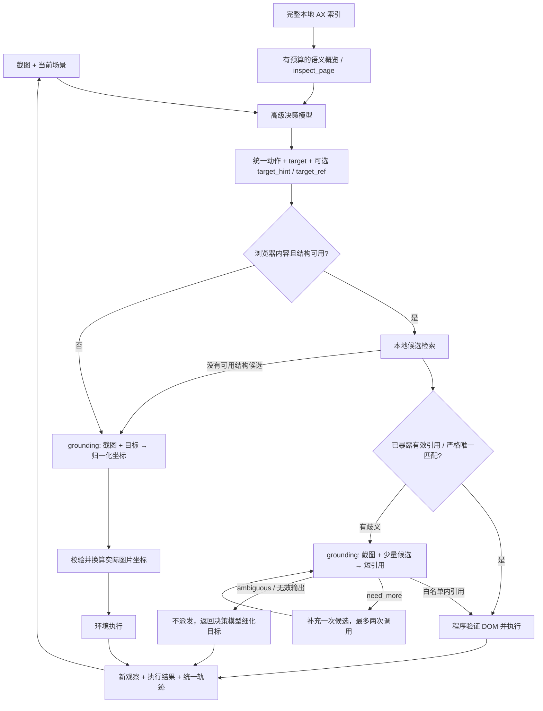

# 网页定位优化实现

决策模型与定位模型独立配置：高级模型根据截图、任务状态和精简网页语义决定动作，定位模型只负责有歧义的节点选择或视觉坐标定位。本机验证使用 Windows Chrome，不依赖 OSWorld。

## 职责命名与模型替换

业务代码、文件、类及注释使用职责或协议名称，不依赖部署模型名称。决策入口为 `model/decision_model.py`；定位入口为 `model/grounding.py`，客户端为 `adapters/grounding.py::GroundingClient`、`adapters/pixel_grounding.py::PixelGroundingClient`、`adapters/normalized_grounding.py::NormalizedGroundingClient`。

实际模型 ID 和旧模型/协议别名集中在 `config/model_registry.py`。配置使用 `planning`、`grounding` 等职责别名，也可直接填任意部署 ID；协议明确分为 `structured`（节点/坐标双模式）、`pixel`（像素点）、`normalized`（归一化点）。未知部署 ID 在 auto 下使用 structured，其他协议需显式配置，不按模型名的子串猜测。

环境变量使用 `PLAN_*`、`GROUNDING_*`。旧决策环境变量通过 `config/environment_aliases.json` 兼容读取，非空的职责变量优先。GUI 默认值和模型选项来自模型预设文件。更换模型时只需更新配置中的 ID、连接信息、协议以及对应 tokenizer/processor；轨迹 schema 中的 `decision`、`grounding` 角色继续兼容。

## 执行链路



场景判定继续使用 `scene.browser_use` 与 `scene.structure_available`，依据前台窗口、焦点和确认的活动网页；光标悬停位置不作为充分条件。工具栏、原生对话框、普通桌面应用以及结构不可用时保持视觉路径。具体边界见 [场景判定文档](browser-use场景判定.md)。

`browser.py` 不再采集整页 DOMSnapshot，也不再按前 4,000 个节点截断观察。AX 数据保留在本地，`browser_index.py` 对全部索引检索；DOM 对象、值与几何只对候选补取。英文词、中文二/三字片段以及数字参与匹配，角色、区域、子目标、焦点和视口共同排序。

区域保留表单、表格行、对话框、语义区域和卡片的事实上下文。对于 Chrome 将 div 卡片标为 ignored 的情况，本地额外保留有后代的结构容器，从有限的邻近正文推导卡片上下文；它们不会变成可点击控件。推导受范围限制，不能保证恢复任意不规范页面结构。无法消除歧义时交回决策模型。

严格匹配要求可操作、角色兼容、原始名称完全相等，且剩余目标唯一。指定区域时必须完整匹配区域或其明确片段；例如“客户9”不会直接匹配“客户99”。重复“保存”按钮不会自动选第一个。决策模型建议输出原始页面标签：

```json
{"next_action":{"type":"click","target":"保存 Bob 的客户记录","target_hint":{"role":"button","name":"保存","scope":"Bob"}}}
```

## 两种模型视图与输入预算

决策视图保留相关正文、金额、表格事实、标题、控件和状态提示，按完整节点选取并补必要祖先。通用包装层在模型视图中折叠，引用显示为 `n17` 等快照内别名。本地保留别名到完整引用的映射，不向模型重复发送完整 snapshot ID。

定位视图只发送当前目标、可选提示、子目标和少量候选的 role/name/value/states/scope。候选只按完整 JSON 行加入；同次输入实际序列化的节点形成独立白名单。定位模型可选择没有出现在决策视图、但出现在本次定位输入中的节点。

| 项目 | 默认值 |
| --- | ---: |
| 决策网页语义 | 2,000 文本 tokens；配置上限 3,500 |
| 决策总输入 | 12,288 tokens；另保留输出和安全余量 |
| 定位候选 | 最多 20 个；补查最多 40 个 |
| 定位文本 | 2,048 tokens；补查 4,096 |
| 定位总输入 | 8,192 tokens，包括图片 |
| 定位输出 | 256 tokens，关闭 thinking |
| 定位图片 | 1 张 |
| 每个目标的定位调用 | 最多 2 次 |

文本较长时，实际送入的候选可以少于 20/40；`candidate_count` 与 `retrieved_count` 分开记录。总预算取 `min(max_input_tokens, context_window-output_reserve-safety_margin)`，部署时将 context_window 改成实际服务限制。

`TokenCounter` 支持本地 tokenizer，以及匹配服务端的 processor 和聊天模板。processor 计数使用实际 PIL 图片，记录模板哈希和图像处理配置。未配置 processor 时 `budget_is_estimated=true`；没有 tokenizer 时使用 UTF-8 字节估算文字，图像采用可配置估计。此时 8,192 是本地估算上限，不能声称服务端真实 token 数完全受控；应结合服务返回的 usage 校准。

真实 processor 计数超预算时先缩小图片，再减少完整候选。裁剪仅用于已确认的同一网页区域，且仅当截图尺寸与 CSS viewport 对齐时自动启用。桌面截图不把 CSS 坐标当成屏幕坐标。保存 `original_size / offset / crop_size / input_size / coordinate_space`，坐标换算不使用配置中的固定屏幕尺寸。

决策模型可输出统一工具动作：

```json
{"next_action":{"type":"inspect_page","query":"客户 Bob 的账单金额","scope_ref":"n17","cursor":null}}
```

`scope_ref`、`cursor` 可省略。分页 cursor 与快照绑定，旧 cursor 会被拒绝。工具结果作为下一次的 `browser_region` 视图参与同一 prompt 编译流程。`get_page_source` 保留兼容，只在显式请求时提供有界、去脚本和敏感输入属性的 DOM 片段；默认不会把整页 HTML 输入模型。

## 缓存和执行前验证

缓存按 target、document 和 URL 隔离，监听 DOM mutation、输入/焦点事件、滚动/缩放，同时检查表单属性摘要。页面导航或语义变化使索引与引用失效；单纯滚动/缩放可复用 AX 原始数据，但清除几何、DOM 对象并生成新快照引用。默认还每秒刷新一次 AX，避免把 AX 更新事件当作完整页面变化检测机制。[CDP Accessibility 定义](https://chromedevtools.github.io/devtools-protocol/tot/Accessibility/)

执行前重新确认前台/页面/document、节点名称、角色、值和状态，以及目标区域的有限语义事实。区域检查查询最小语义子树，兼容包装层，并验证目标仍在该区域。无关时钟更新不会单独阻止操作；客户行或卡片的身份文本变化会拒绝旧操作。随后验证连接、禁用、可见、遮挡与位置稳定，才派发浏览器输入。

页面与截图不能构成浏览器事务，因此验证后与派发间仍存在极短竞态。派发后的失败记为 `uncertain`，本步不会再补一次视觉点击。DOM 输入成功也不等于业务任务成功，后者仍由新观察和独立 evaluator 判断。

## 统一定位接口与轨迹 v3

`GroundingRequest` 包含 screenshot、action、target、mode、可选 candidates/target_hint、snapshot_id、ref_aliases、roi、反馈与补查标记。`GroundingResult` 统一提供 status、target_ref、point、metadata、calls，旧 `locate()` 入口保留。状态为 ok 时引用与坐标二选一；point 使用模型实际输入图片上的 `0 <= x,y < 1000` 协议，1000 会映射到边界之外，因此拒绝。

网页与普通 GUI 共用 `task/outcome/steps` 和训练导出器，浏览器仅增加可选 `observation.context`。v3 保留 v2 的 policy_input/policy_output/decision_calls，并增加：

| 字段 | 记录内容 |
| --- | --- |
| model_calls | decision / grounding 各次实际输入、原始响应、角色、模型、固定 revision、生成参数、usage、token IDs/logprobs、停止原因、重试与时延 |
| model_calls.prompt_metadata | 实际候选白名单、别名、快照、预算、计数方法、图片变换与模板/processor 信息 |
| grounding_metadata | 本地检索候选与定位结果，区分检索范围和模型实际可见范围 |
| offline_grounding_labels | 严格匹配直接执行产生的离线监督提示与节点标签；不伪装成模型调用 |
| grounding_labels | 可选人工/评测真值，仅用于指标计算，不据执行成功推测目标正确 |

`dump_trajectory` 按内容哈希去重保存包括定位裁剪图在内的图片，`restore_messages` 可恢复原调用字节。`import_external_episode` 接受同一可选字段，不为缺失的真实 prompt 补造行为策略输入。

SFT 导出按角色选择，domain 不参与分支：

```python
decision_rows = iter_sft_records(trajectory, actor_role="decision")
ground_rows = iter_sft_records(trajectory, actor_role="grounding", include_offline_labels=True)
```

默认要求独立任务成功，过滤无效/长度截断响应。离线定位标签仅在本步派发执行成功时导出，并标记 `provenance=offline_deterministic`；数据清洗仍需进一步验证目标正确性。只对 completion 计算 loss，不对输入中的重试历史计算 loss。

定位模型 on-policy RL 必须指定 `actor_role="grounding"` 和固定 checkpoint revision：

```python
rows = iter_on_policy_records(trajectory, policy_revision="student-checkpoint-123", actor_role="grounding")
```

只接收该 revision 实际采样、具备服务器 completion token IDs 与等长有限 token logprobs、且有独立 reward 的调用。格式失败也是采样输出；纯传输失败不算策略采样。确定性标签、高级决策模型和其他 API 模型的输出不能充当目标定位 checkpoint 的 on-policy 样本。vLLM 支持时可启用 return_token_ids / return_tokens_as_token_ids 扩展，不会用响应字符串重新 tokenize 冒充采样 IDs。[vLLM 协议定义](https://docs.vllm.ai/en/latest/api/vllm/entrypoints/openai/chat_completion/protocol/)

这里实现采集、SFT 导出和严格 RL 数据入口；完整 trainer、优势计算、KL、奖励设计仍由训练端实现。

## Windows 验证与运行

```powershell
.\.venv\Scripts\python.exe -m pytest -q
.\.venv\Scripts\python.exe script\smoke_browser_windows.py --channel chrome
.\.venv\Scripts\python.exe script\benchmark_grounding_windows.py --channel chrome
```

基准报告保存到 `artifacts/grounding-qa/report.json`。本机 Chrome 验证了 1,000、4,501、10,001 个按钮页面的末尾中文目标：本地候选均召回并直接执行，未调用定位 API，金额事实进入决策输入。此结果是有限构造页面的工程验证，不是模型准确率或 OSWorld 分数。报告分别保留冷采集时间、缓存采集与检索 P50/P95、执行加观察时间；大页面冷启动仍有秒级开销。

2026-10-08 的本机测量（Chrome 155.0.8059.39）：

| 页面按钮数 | 本地索引节点数 | 首次 AX 采集与索引 | 末尾目标召回/直接执行 |
| --- | ---: | ---: | --- |
| 1,000 | 2,007 | 132 ms | 通过 |
| 4,501 | 9,009 | 803 ms | 通过 |
| 10,001 | 20,009 | 2,344 ms | 通过 |

24 次缓存采集 P50/P95 为 11.79/20.85 ms，25 次本地检索 P50/P95 为 5.89/12.91 ms；这些是此机器上的小样本工程时延，均不包含模型推理。Windows 表单的脚本策略测试 5 步完成，独立得分为 1，定位调用为 0。职责命名与配置兼容改造后，自动化回归为 64 项，Chrome GUI 默认值和旧会话类型兼容检查通过。

测试覆盖重复按钮/表格行、嵌套表单与 div 卡片、关键正文、动态身份文字、无关文字更新、遮挡、失效引用、场景切换、候选预算、坐标越界、裁剪/缩放、精确 prompt 回放以及 SFT/RL 角色隔离。定位节点协议与 OpenAI 兼容客户端使用测试替身和 HTTP Mock 验证，不将这些数字报作模型效果。

接入真实模型时，决策与定位端点分别提供。实际模型 ID 写在 PLAN_MODEL、GROUNDING_MODEL，定位端点写在 GROUNDING_API_URL：

```powershell
# 密钥和端点使用本机环境变量，替换成服务真实配置。
.\.venv\Scripts\python.exe run_browser_windows.py `
  --model $env:PLAN_MODEL --api-url $env:PLAN_API_URL `
  --api-key-env PLAN_API_KEY --thinking-style none `
  --ground-model $env:GROUNDING_MODEL --ground-url $env:GROUNDING_API_URL `
  --ground-type structured --ground-key-env GROUNDING_API_KEY `
  --ground-thinking-style vllm --ground-processor-path $env:GROUNDING_PROCESSOR_PATH
```

也可将定位模型和端点换成可用的外部 API，使用该服务对应的 thinking-style 联调协议；这种轨迹是该 API 模型的离线数据。模型名、URL、processor 与 thinking-style 必须来自实际部署。当前本机未配置可用模型 API，真实模型准确率和推理 P50/P95 尚未测量。

定位模型小型真值测试入口：

```powershell
.\.venv\Scripts\python.exe script\benchmark_grounding_windows.py --channel chrome `
  --api-url $env:GROUNDING_API_URL --model $env:GROUNDING_MODEL `
  --processor-path $env:GROUNDING_PROCESSOR_PATH
```

该入口分别报告检索召回、模型可见候选、重复按钮节点选择、canvas 坐标命中、实际 usage 与模型时延；无 API 时相关字段为 null。`metrics.summarize_trajectory` 只有在提供 grounding_labels 时计算准确率，不把检索失败算作模型失败，不把 DOM 派发当作任务成功。
